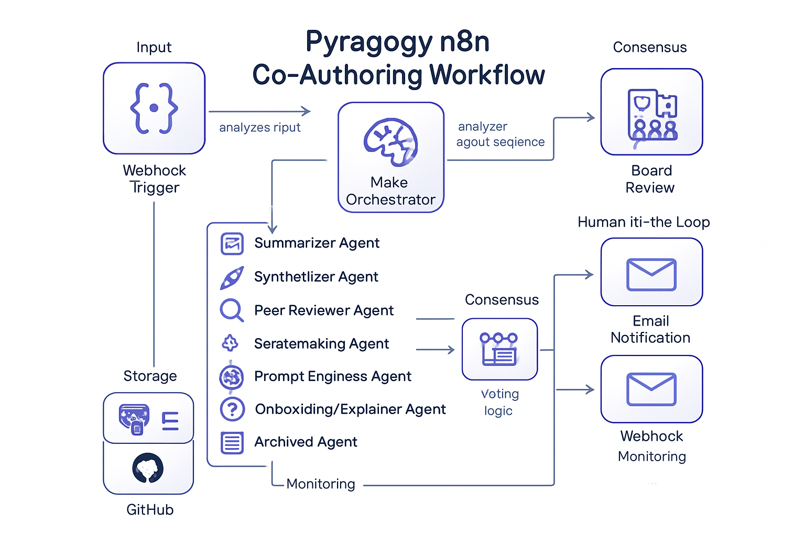
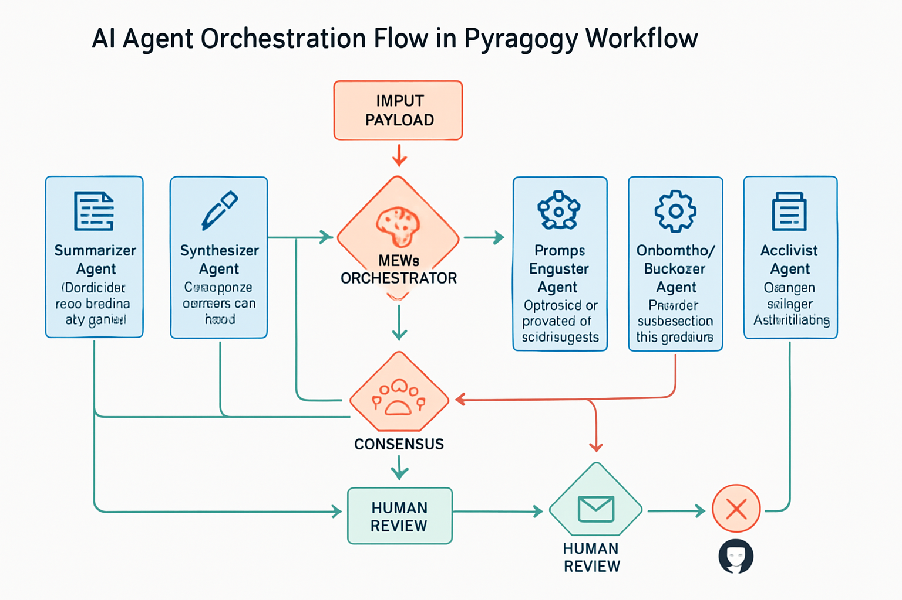

# Improved Documentation: Pyragogy n8n Co-Authoring Workflow

This section provides an in-depth look at the existing documentation, incorporating flowcharts, output examples, and detailed descriptions of AI agent roles, to enhance the clarity and understanding of the workflow.

## 1. n8n Workflow Flowchart

To facilitate visual understanding of the `pyragogy_master_workflow.json`, we present a conceptual flowchart illustrating the interactions between the main nodes and AI agents. This diagram aims to provide a clear overview of the process, from input reception to final content archiving.

```mermaid
graph TD
    A[Start] --> B(Webhook Trigger)
    B --> C{Check DB Connection}
    C --> D[Meta-Orchestrator]
    D --> E[Parse Orchestration Plan]
    E --> F{More Agents to Run?}
    F -- Yes --> G[Prepare Agent Input]
    G --> H{Route Agents with Switch}
    H -- Summarizer --> I[Summarizer Agent]
    H -- Synthesizer --> J[Synthesizer Agent]
    H -- Peer Reviewer --> K[Peer Reviewer Agent]
    H -- Sensemaking Agent --> L[Sensemaking Agent]
    H -- Prompt Engineer --> M[Prompt Engineer Agent]
    H -- Onboarding/Explainer --> N[Onboarding/Explainer Agent]
    H -- Archivist --> O[Add Handbook Metadata]
    O --> P[Generate Content for Review]
    P --> Q[Generate Review ID]
    Q --> R[Send Review Request Email]
    R --> S[Wait for Human Approval]
    S --> T{Human Decision Split}
    T -- Approved --> U[Save to handbook_entries]
    U --> V[Prepare Approved Contribution Data]
    V --> W[Save Agent Contribution (Approved)]
    W --> X[Generate GitHub File Path]
    X --> Y{GitHub Enabled?}
    Y -- Yes --> Z[Commit to GitHub (Approved)]
    T -- Rejected --> AA[Log Human Rejection]
    Z --> AB[Merge Archivist Paths]
    AA --> AB
    AB --> AC[Log Agent Output]
    AC --> F
    K --> AD[Evaluate Board Consensus]
    L --> AD
    M --> AD
    AD --> AE{Check Redraft Needed}
    AE -- Yes --> AF[Handle Redraft]
    AF --> J
    AE -- No --> AC
    F -- No --> AG[End]
```

### Diagram Description

The diagram above illustrates the main workflow. It begins with a webhook trigger, proceeds with a database connection check, and then passes to the Meta-Orchestrator which determines the sequence of agents. The flow branches through a Switch node to execute specific agents. The review nodes converge into a consensus mechanism that can trigger redrafting cycles. The Human-in-the-Loop process is managed via email and a waiting webhook. Finally, the approved content is saved to the database and committed to GitHub.

## 2. Output Examples

### Example Handbook Excerpt

```markdown
---
title: "Introduction to Multi-Agent Orchestration"
tags: ["AI", "automation", "n8n", "agents", "orchestration"]
phase: "final"
rhythm: "on-demand"
---

Multi-agent orchestration represents an advanced paradigm in automating complex processes, where various specialized AI agents collaborate to achieve a common goal. Within the context of the Pyragogy Handbook, this approach enables the autonomous generation and review of content, leveraging the complementary capabilities of agents such as the Summarizer, Synthesizer, and Peer Reviewer. Each agent operates independently but in a coordinated manner, passing its output to the next in the processing chain, thereby ensuring an efficient and iterative workflow.

This chapter will explore in detail the principles of multi-agent orchestration, the specific roles of each agent within the Pyragogy workflow, and how their synergistic interaction contributes to the creation of a dynamic and constantly updated handbook.
```

### Output Description

The example shows a fragment of a Handbook chapter. Note the YAML front-matter block at the beginning of the file, including metadata such as title, tags, phase, and rhythm. The content follows Markdown format.

## 3. Detailed AI Agent Roles

### Meta-Orchestrator

Analyzes initial input and determines the optimal sequence of agents. Uses LLM for dynamic decisions and plans the entire workflow.

### Summarizer Agent

Condenses long text into key points, useful in early stages for extracting essentials.

### Synthesizer Agent

Creates new content based on summaries or raw input, handles redrafts for iterative improvement.

### Peer Reviewer Agent

Reviews drafts, flags major issues, and suggests improvements. Contributes to the consensus mechanism.

### Sensemaking Agent

Performs contextual analysis, finds gaps or patterns, and provides depth. Also flags major issues.

### Prompt Engineer Agent

Optimizes prompts for next agent in the chain, enhancing effectiveness and coordination.

### Onboarding/Explainer Agent

Provides clarifications, status explanations, and usage instructions for users.

### Archivist Agent

Finalizes content: creates metadata, YAML front-matter, archives to DB and GitHub, ensures traceability.

These agents function in synergy under the Meta-Orchestrator, forming an iterative, human-supervised co-authoring loop.

## 4. Workflow Visualizations

### Workflow Architecture Diagram


*Figure 1: Architecture diagram showing orchestration layers and agent interactions.*

### n8n Interface Mockup


*Figure 2: n8n UI showing interconnected nodes in the Pyragogy workflow.*

### AI Agent Flow Diagram


*Figure 3: Agent orchestration and consensus process.*

### Monitoring Dashboard


*Figure 4: Grafana dashboard mockup for real-time metrics and alerts.*

## 5. Output File Structure

```markdown
---
title: "Chapter Title"
tags: ["tag1", "tag2", "tag3"]
phase: "draft" | "review" | "final"
rhythm: "on-demand" | "scheduled" | "continuous"
created_by: "AI Village"
created_at: "2024-01-15T10:30:00Z"
version: 1
agents_involved: ["Summarizer", "Synthesizer", "Peer Reviewer"]
review_status: "approved" | "pending" | "rejected"
github_path: "chapters/chapter_slug_v20240115103000.md"
---

# Chapter Content
```

### Naming Conventions

Format: `{chapter_slug}_v{timestamp}.md`

Example: `multi_agent_orchestration_v20240115103000.md`

### Directory Organization

```
handbook/
├── chapters/
├── appendices/
├── images/
├── templates/
└── archive/
```

## 6. Integration with External Systems

### API Endpoints

```
POST /webhook/pyragogy/process
POST /webhook/pyragogy/approve/{review_id}
POST /webhook/pyragogy/reject/{review_id}
GET /api/status/{workflow_run_id}
```

### Slack Notification Example

```javascript
const slackMessage = {
  channel: "#pyragogy-updates",
  text: `New chapter generated: ${$json.title}`,
  attachments: [{
    color: "good",
    fields: [
      { title: "Phase", value: $json.phase, short: true },
      { title: "Agents Involved", value: $json.agents_involved.join(", "), short: true }
    ]
  }]
};
return { json: slackMessage };
```

### CMS Publishing Example

```javascript
const wordpressPost = {
  title: $json.title,
  content: $json.content,
  status: "publish",
  categories: $json.tags,
  meta: {
    pyragogy_version: $json.version,
    ai_generated: true,
    agents_used: $json.agents_involved
  }
};
return { json: wordpressPost };
```

---


